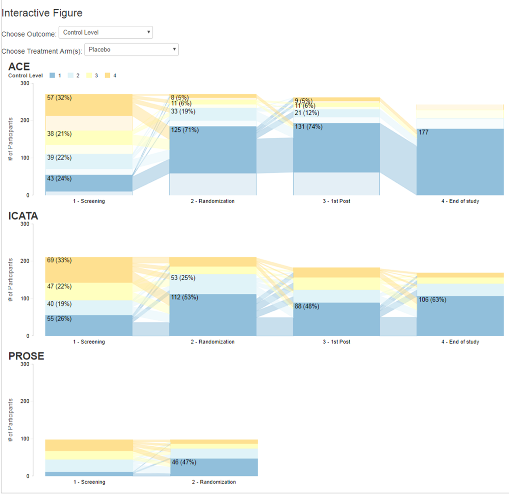

# Asthma Control over Time in the Inner City Asthma Consortium

This repository contains an [interactive figure](https://rhoinc.github.io/asthma-control-graphic/) showing asthma control level over time using data from 3 studies from the Inner City Asthma Consortium (ICAC). The interactive graphic expands upon the information presented in Figure 1 from <i>A computerized decision support tool to implement asthma guidelines for children and adolescents is effective in gaining and maintaining asthma control</i> by Sorkness et al, which is currently under review at the Journal of Allergy and Clinical Immunology (JACI). A static version of the figure is shown below, and the interactive version, created using the files in this repository, can be accessed [here](https://rhoinc.github.io/asthma-control-graphic/).

  

The initial view of the figure shows the proportion and number of study participants who were determined to be at Control Level 1 (well controlled) through Control Level 4 (poorly controlled) at screening visit, randomization, first and last post-randomization visits for each clinical trial. Users can use the controls at the top of the page to change the outcome of interest and to filter the figures to only participants receiving active treatment or placebo.

Users can also click any bar segment to overlay a flow diagram showing how participants arrived at that point, and where they go afterward. For example, clicking on the top segment in the rightmost bar shows that participants that moved to CL 1 came equally from CL 1 to 4 at Screening, with the exception of PROSE.  
